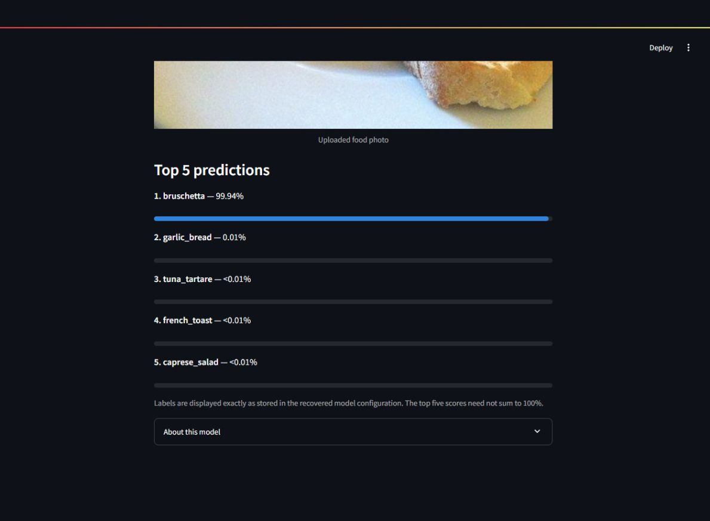

# ViT Food Image Classifier — 101 Food-101 labels


An individual university fine-tuning and Streamlit project by Faizan Tariq, using the recovered Vision Transformer checkpoint. Upload a food photograph to see its five highest-scoring saved labels. This project belongs to the [Transformer fine-tuning umbrella repository](../README.md).


## What the recovered evidence establishes


- `config.json` contains 101 labels, in exactly the same order as [ETH Zurich's Food-101 dataset metadata](https://huggingface.co/datasets/ethz/food101).

- The recovered checkpoint's classifier weight has shape **101 × 768**. It loads with no missing, unexpected or mismatched tensors.

- The owner identified the original input path as `/kaggle/input/food41/images`, from [kmader/food41 - Food Images (Food-101)](https://www.kaggle.com/datasets/kmader/food41). Here `food41` is a Kaggle slug, not a 41-class count. The checkpoint and all labels confirm a 101-class output space.

- The owner-reported dataset source and saved labels agree on Food-101. The exact training subset or split is **not recoverable from these artifacts**. No ViT training notebook, trainer state, training arguments or evaluation report was recovered in the project folder. Dataset subset, epochs, optimizer, learning rate, frozen layers and original evaluation accuracy remain unverified.

- This is a recovered fine-tuning project using an existing ViT architecture, not a new architecture. The precise upstream pretrained checkpoint cannot be established from these files; we do not assume a particular Google model ID.


## Architecture and preprocessing


`Image → RGB conversion → saved ViT image processor → ViT → 101 logits → softmax → top 5 saved labels`


`ViTForImageClassification`: 85,876,325 parameters; 12 transformer layers; 768 hidden dimensions; 12 attention heads; 3 input channels; 16×16 patches; 101-class linear head. This matches the ViT-Base architecture dimensions.


The original processor resizes to **224×224** using bilinear interpolation, rescales pixels by 1/255, then normalizes each channel with mean 0.5 and standard deviation 0.5. The app applies EXIF orientation and converts grayscale/RGBA inputs to RGB. No replacement preprocessing or retraining was introduced.


## Verified local examples


Four Food-101 validation rows were used as smoke tests. Their images are not committed to this repository.


| Validation row | Dataset label | Top prediction | Softmax score |

|---|---|---|---|

| 0 | beignets | beignets | 99.25% |

| 1000 | bruschetta | bruschetta | 99.94% |

| 5000 | carrot_cake | carrot_cake | 99.33% |

| 10000 | frozen_yogurt | frozen_yogurt | 98.45% |


All four produced finite 101-element probability vectors summing to approximately one, with correctly mapped top-five labels. These examples are **not an accuracy benchmark**; their relationship to the original training split is unknown. Scores are not calibrated confidence. No test accuracy or generalization score has been established.


## Run locally


Use **Python 3.11**. From the repository root:


```bash

python -m venv .venv-vit

# Windows: .venv-vit\Scripts\activate

# Linux/macOS: source .venv-vit/bin/activate

python -m pip install -r ViT-finetuned/requirements.txt

python -m streamlit run ViT-finetuned/app.py

```


Dependencies are scoped to this subproject. CPU PyTorch 2.8.0, Transformers 4.53.3 and the saved ViT image processor are used; torchvision is unnecessary. T5 has its own independent requirements and application.


Upload a JPG/PNG food photograph, at most 10 MB and 16 million pixels. The model is cached once per app process. Classification runs on CPU, serialized between users to bound concurrent inference memory. Uploaded images stay in server memory; application code does not save them or send them to an inference API.


## Model storage and integrity


The **343,528,508-byte** `model.safetensors` is excluded from ordinary Git history. The owner's existing public repository already contains the identical recovered weight:


- Model: [FaizanTariq109/ViTFinetuned](https://huggingface.co/FaizanTariq109/ViTFinetuned)

- Pinned revision: `ae9a5fe0a1787ba88cb00a0e51e0d2989dc562fc`

- Weight SHA-256: `f705b57ae486d42cd55a7314b821c400c5f6c0f54b4b39b20dd6c787160335c1`


Anonymous download into an empty cache, checksum validation and inference were verified locally. The app uses an original weight placed beside `app.py` when present. Otherwise it anonymously downloads only that weight from the pinned Hub revision, using the standard Hugging Face cache. No API key is required. Checksums verify the weight and saved configuration; canonical JSON checks tolerate Git's platform line-ending conversion. Loading uses safetensors and local configuration with no remote model code.


No model upload or remote model modification was needed for this preparation. A cold deployment needs roughly 344 MB of network transfer plus dependency installation; cached reruns reuse the weight. A host restart/cache eviction may require another download. The historical model repository name is preserved.


## Streamlit Community Cloud


After the reviewed changes are pushed, create an app with:


- Repository: `FaizanTariq109/Finetuning-Project`

- Branch: `main`

- Main file: `ViT-finetuned/app.py` (case-sensitive)

- Python: **3.11** in Advanced settings

- Dependencies: `ViT-finetuned/requirements.txt`

- Secrets: **none** required


Community Cloud [looks in the entrypoint directory before the repository root](https://docs.streamlit.io/deploy/streamlit-community-cloud/deploy-your-app/app-dependencies), so this app uses its own dependency set. No `packages.txt`, custom `.streamlit/config.toml`, GPU or Hugging Face upload is required. Linux dependency compatibility can be checked locally by resolution, but actual Linux runtime/cold-start behavior must be verified after deployment.


The first classification can take longer while the model downloads. Download/load failures show a concise message and a manual retry button. The app is not yet publicly deployed; a verified Live Demo link will be added after deployment.


## Limitations


- Closed set of 101 food categories: non-food or unfamiliar dishes still receive food predictions.

- No food detection, portion estimation, nutrition estimation or allergy identification.

- Resizing can distort the original image aspect ratio; it intentionally follows the recovered processor.

- No recovered training recipe or reproducible performance benchmark. High sample scores do not establish robust real-world accuracy.

- Hosting memory and cold starts depend on the platform. Concurrent requests are serialized and can queue.


## Screenshot / demo


The application shows the uploaded image, five saved class labels and probability bars. The screenshot below is from a local browser run on a Food-101 validation example (row 1000; original imagery from Foodspotting via Food-101). It demonstrates the interface, not benchmark performance.

 The public demo link remains pending deployment; no placeholder URL is used.
