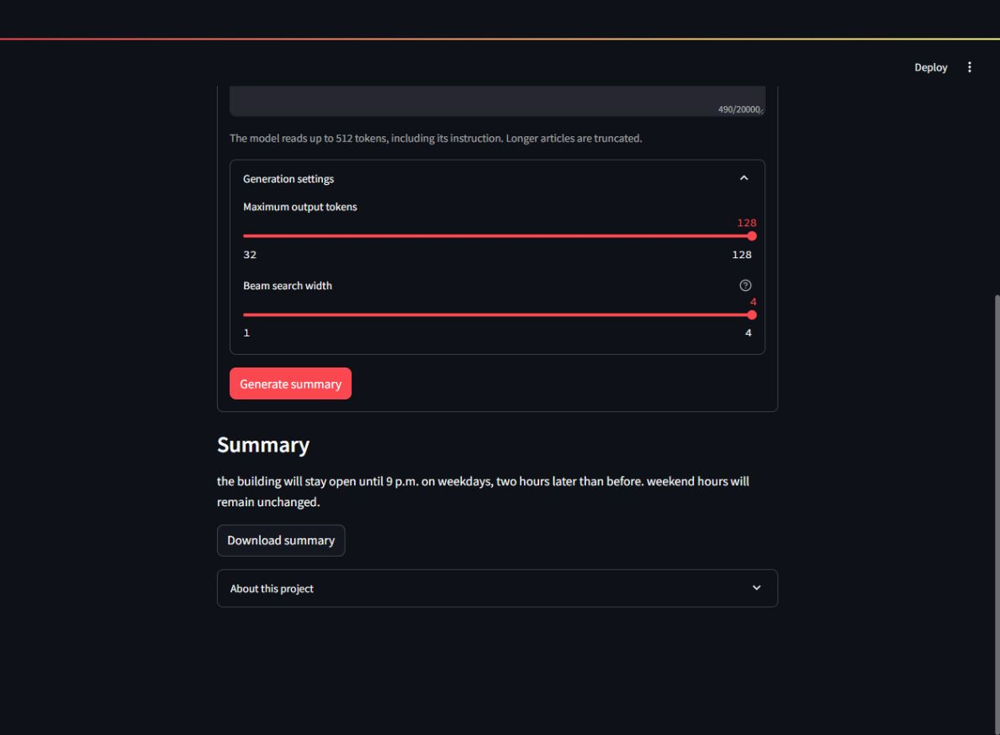

# T5 News Summarizer

A Streamlit application that generates short English news summaries using the T5-small checkpoint recovered from my university fine-tuning project.

**Author:** Faizan Tariq. I completed the fine-tuning project and Streamlit application individually. T5 and the pretrained base architecture are from the original T5 authors; I do not claim to have designed that architecture.

**Status:** Local inference and public model download verified; application deployment is pending. There is no live demo URL yet.

## What it does

- Summarizes pasted English news articles without a paid text-generation API.
- Provides a sample article, bounded beam-search settings, and a downloadable summary.
- Loads the original recovered checkpoint rather than silently substituting a base model.
- Checks model-file SHA-256 hashes before loading and caches one model per server process.
- Limits input to 512 model tokens and warns when an article is truncated.

## How it works

`Article → summarize: prefix → SentencePiece tokenizer → T5 encoder/decoder → beam search → summary`

The Streamlit UI lives in `app.py`. `model_runtime.py` handles checkpoint selection, integrity checks and CPU inference. The model loads on the first generation request, then remains in Streamlit's resource cache. A lock serializes requests using that cached model to limit concurrent memory use. No submitted article is written to disk by the application or sent to a separate generation API.

The model has 60,506,624 parameters, a 512-dimensional hidden representation, and six encoder and six decoder layers. These values were checked against the recovered configuration and loaded model.

## Training provenance and evaluation

The original report describes T5-small fine-tuning on CNN/DailyMail v3.0.0 for two epochs. The training notebook is unavailable. The dataset split, hyperparameters and original ROUGE results cannot currently be reproduced from this repository, so **no ROUGE score is presented as a verified result**.

The report is preserved, clearly marked as historical, in [the original training report](docs/training-report-historical.md). Local smoke tests establish that the recovered configuration, tokenizer and weights load together and produce summaries. They do not establish benchmark performance or factual reliability. See [validation notes](VALIDATION.md).

## Local setup

Use **Python 3.11**, matching the tested environment. From the repository root:

```bash
python -m venv .venv-t5
# Windows PowerShell:
.venv-t5\Scripts\Activate.ps1
# Linux/macOS instead:
# source .venv-t5/bin/activate
python -m pip install -r t5-small-finetuned/requirements.txt
python -m streamlit run t5-small-finetuned/app.py
```

Dependencies are pinned for this app separately from the ViT app. PyTorch is CPU-only; a GPU/CUDA installation is not required. The tested model uses the Transformers version recorded in its saved configuration.

The original weights are **not committed to GitHub**. For the current local setup, place the verified `model.safetensors` beside `app.py`, alongside the tracked configuration/tokenizer files. A missing checkpoint results in a configuration error; the app never falls back to public base T5 weights.

### Model configuration

Settings can be exported as environment variables or entered as root-level keys in Streamlit Secrets. `.env` files are not automatically loaded.

| Setting | Purpose |
|---|---|
| `T5_MODEL_DIR` | Optional local folder containing the complete verified model bundle. Relative paths resolve against this app folder, not the launch directory. |
| `T5_MODEL_REPO` | Public Hugging Face model repository in `owner/name` form, used when no local checkpoint is present. |
| `T5_MODEL_REVISION` | Full 40-character model-repository commit SHA. A mutable `main` reference is deliberately not accepted. |

Precedence is an explicit local folder, then the checkpoint beside the app, then the configured Hub repository. An invalid explicit folder fails rather than quietly switching models.

The proposed public bundle consists of `model.safetensors`, `config.json`, `generation_config.json`, `spiece.model`, `tokenizer.json`, `tokenizer_config.json`, and `special_tokens_map.json`. It must match [model-manifest.json](model-manifest.json). Public model download needs no access token. The owner published the bundle at https://huggingface.co/FaizanTariq109/t5-small-news-summarizer. Anonymous download, all seven checksums and inference were verified at revision `1cc579fc6a968c116b2358a5a80d6c45d5baba64`.

## Deployment

Target: **Streamlit Community Cloud**, initially with Python 3.11 and entrypoint `t5-small-finetuned/app.py` in the existing [Finetuning-Project repository](https://github.com/FaizanTariq109/Finetuning-Project).

Application code stays on GitHub; the 242 MB checkpoint is intended for a separate public Hugging Face model repository. The first model request downloads a pinned snapshot into the host's cache. Subsequent requests reuse the loaded model; a fresh host can download it again. This keeps weight files out of normal Git history, but adds a network dependency and cold-start delay. Model storage does not remove the application's RAM requirement.

See the [step-by-step deployment guide](DEPLOYMENT.md). The model card is published. GitHub approval and real cloud checks are still required. This README does not claim a deployed application or guaranteed fit within Community Cloud limits.

## Limitations

- English news is the intended input; other languages/domains have not been validated.
- Only the first 512 tokens, including the instruction and special tokens, reach the model. This app does not implement document chunking.
- Summaries can omit qualifications, important details or introduce errors. Check them against the source.
- Output is capped at 128 tokens and beam width at four to bound CPU work on a shared host.
- The model loads on demand; the first request can be substantially slower than later ones.
- The single-process inference lock bounds concurrent work but is not a global rate limiter.
- Training and benchmark reproduction remain unavailable without the original notebook/data split.

## Files

| File | Role |
|---|---|
| `app.py` | Streamlit UI |
| `model_runtime.py` | Model selection, artifact verification and inference |
| `model-manifest.json` | Hashes of the verified recovered artifacts |
| `requirements.txt` | App-specific dependencies |
| `config.json`, tokenizer files | Original model configuration and tokenizer |
| `VALIDATION.md` | Local checks and their limits |
| `DEPLOYMENT.md` | Hosting steps and troubleshooting |
| `docs/training-report-historical.md` | Original, unverified evaluation report |

Original university files are retained separately in the owner's read-only archive. This repository contains preparation fixes, not a retraining or architectural rewrite.

## Local demo screenshot



Captured during local validation; this is not a public deployment.

